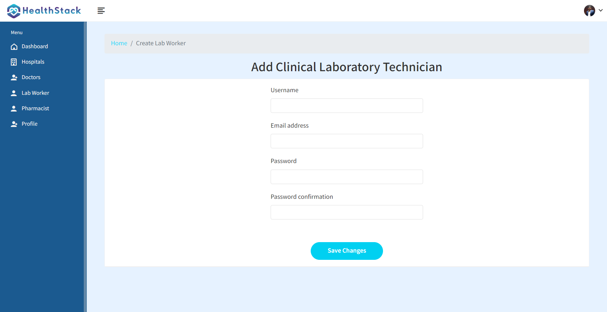
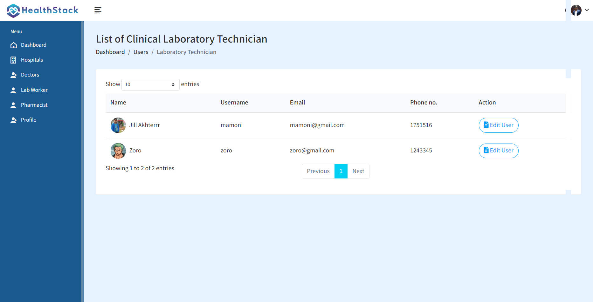
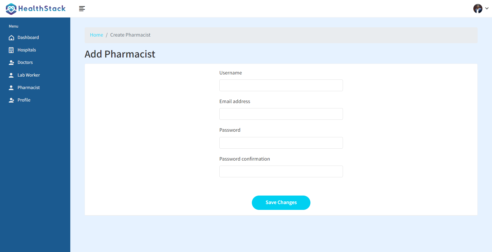
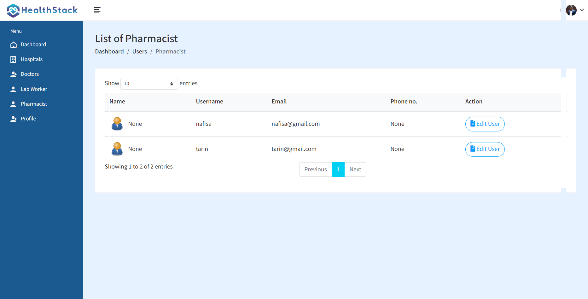

# Welcome To ServiceProvider Admin

ServiceProvider Admin is a cruical User for our project.

## ServiceProvider Admin Task

- Accept / Reject Professional
- Add and View Labworker
- Add and View StoreManager
- Add,Edit and View ServiceProvider
- Update ServiceProvider Information

# Accept/Reject professional

```python
def accept_professional(request,pk):
    professional = Professional_Information.objects.get(professional_id=pk)
    professional.register_status = 'Accepted'
    professional.save()

    experience= Experience.objects.filter(professional_id=pk)
    education = Education.objects.filter(professional_id=pk)

    # Mailtrap
    professional_name = professional.name
    professional_email = professional.email
    professional_department = professional.department_name.ServiceDepartment_name

    professional_specialization = professional.specialization.specialization_name

    subject = "Acceptance of Professional Registration"

    values = {
            "professional_name":professional_name,
            "professional_email":professional_email,
            "professional_department":professional_department,

            "professional_specialization":professional_specialization,
        }

    html_message = render_to_string('service_provider_admin/accept-professional-mail.html', {'values': values})
    plain_message = strip_tags(html_message)

    try:
        send_mail(subject, plain_message, 'service_provider_admin@gmail.com',  [professional_email], html_message=html_message, fail_silently=False)
    except BadHeaderError:
        return HttpResponse('Invalid header found')

    messages.success(request, 'Professional Accepted!')
    return redirect('register-professional-list')

def reject_professional(request,pk):
    professional = Professional_Information.objects.get(professional_id=pk)
    professional.register_status = 'Rejected'
    professional.save()

    # Mailtrap
    professional_name = professional.name
    professional_email = professional.email
    professional_department = professional.department_name.ServiceDepartment_name
    professional_service_provider = professional.service_name.name
    professional_specialization = professional.specialization.specialization_name

    subject = "Rejection of Professional Registration"

    values = {
            "professional_name":professional_name,
            "professional_email":professional_email,
            "professional_department":professional_department,
            "professional_service_provider":professional_service_provider,
            "professional_specialization":professional_specialization,
        }

    html_message = render_to_string('service_provider_admin/reject-professional-mail.html', {'values': values})
    plain_message = strip_tags(html_message)

    try:
        send_mail(subject, plain_message, 'service_provider_admin@gmail.com',  [professional_email], html_message=html_message, fail_silently=False)
    except BadHeaderError:
        return HttpResponse('Invalid header found')

    messages.success(request, 'Professional Rejected!')
    return redirect('register-professional-list')
```


# Add and View Labworker

```python
def add_lab_worker(request):
    if request.user.is_service_provider_admin:
        user = Admin_Information.objects.get(user=request.user)

        form = LabWorkerCreationForm()

        if request.method == 'POST':
            form = LabWorkerCreationForm(request.POST)
            if form.is_valid():
                # form.save(), commit=False --> don't save to database yet (we have a chance to modify object)
                user = form.save(commit=False)
                user.is_labworker = True
                user.save()

                messages.success(request, 'Clinical Laboratory Technician account was created!')

                # After user is created, we can log them in
                #login(request, user)
                return redirect('lab-worker-list')
            else:
                messages.error(request, 'An error has occurred during registration')

    context = {'form': form, 'admin': user}
    return render(request, 'service_provider_admin/add-lab-worker.html', context)
```




# Add and View StoreManager

```python
def add_storeManager(request):
    if request.user.is_service_provider_admin:
        user = Admin_Information.objects.get(user=request.user)
        form = StoreManagerCreationForm()

        if request.method == 'POST':
            form = StoreManagerCreationForm(request.POST)
            if form.is_valid():
                # form.save(), commit=False --> don't save to database yet (we have a chance to modify object)
                user = form.save(commit=False)
                user.is_storeManager = True
                user.save()

                messages.success(request, 'StoreManager account was created!')

                # After user is created, we can log them in
                #login(request, user)
                return redirect('storeManager-list')
        else:
            messages.error(request, 'An error has occurred during registration')

    context = {'form': form, 'admin': user}
    return render(request, 'service_provider_admin/add-storeManager.html', context)
```




# Add,Edit and View ServiceProvider

```python
def add_service_provider(request):
    if  request.user.is_service_provider_admin:
        user = Admin_Information.objects.get(user=request.user)

        if request.method == 'POST':
            service_provider = ServiceProvider()

            if 'featured_image' in request.FILES:
                featured_image = request.FILES['featured_image']
            else:
                featured_image = "departments/default.png"

            service_name = request.POST.get('service_name')
            address = request.POST.get('address')
            description = request.POST.get('description')
            email = request.POST.get('email')
            phone_number = request.POST.get('phone_number')
            profession = request.POST.get('type')
            specialization_name = request.POST.getlist('specialization')
            department_name = request.POST.getlist('department')
            service_name = request.POST.getlist('service')


            service_provider.name = service_name
            service_provider.description = description
            service_provider.address = address
            service_provider.email = email
            service_provider.phone_number =phone_number
            service_provider.featured_image=featured_image
            service_provider.profession=profession

            # print(department_name[0])

            service_provider.save()

            for i in range(len(department_name)):
                departments = ServiceDepartment(service_provider=service_provider)
                # print(department_name[i])
                departments.ServiceDepartment_name = department_name[i]
                departments.save()

            for i in range(len(specialization_name)):
                specializations = specialization(service_provider=service_provider)
                specializations.specialization_name=specialization_name[i]
                specializations.save()

            for i in range(len(service_name)):
                services = service(service_provider=service_provider)
                services.service_name = service_name[i]
                services.save()

            messages.success(request, 'ServiceProvider Added')
            return redirect('service_provider-list')

        context = { 'admin': user}
        return render(request, 'service_provider_admin/add-service_provider.html',context)
```


# Edit ServiceProvider Information

```python
def edit_service_provider(request, pk):
    if  request.user.is_service_provider_admin:
        user = Admin_Information.objects.get(user=request.user)
        service_provider = ServiceProvider.objects.get(service_provider_id=pk)
        old_featured_image = service_provider.featured_image

        if request.method == 'GET':
            specializations = specialization.objects.filter(service_provider=service_provider)
            services = service.objects.filter(service_provider=service_provider)
            departments = ServiceDepartment.objects.filter(service_provider=service_provider)
            context = {'service_provider': service_provider, 'specializations': specializations, 'services': services,'departments':departments, 'admin': user}
            return render(request, 'service_provider_admin/edit-service_provider.html',context)

        elif request.method == 'POST':
            if 'featured_image' in request.FILES:
                featured_image = request.FILES['featured_image']
            else:
                featured_image = old_featured_image

            service_name = request.POST.get('service_name')
            address = request.POST.get('address')
            description = request.POST.get('description')
            email = request.POST.get('email')
            phone_number = request.POST.get('phone_number')
            profession = request.POST.get('type')

            specialization_name = request.POST.getlist('specialization')
            department_name = request.POST.getlist('department')
            service_name = request.POST.getlist('service')

            service_provider.name = service_name
            service_provider.description = description
            service_provider.address = address
            service_provider.email = email
            service_provider.phone_number =phone_number
            service_provider.featured_image =featured_image
            service_provider.profession =profession

            # specializations.specialization_name=specialization_name
            # services.service_name = service_name
            # departments.ServiceDepartment_name = department_name

            service_provider.save()

            # Specialization
            for i in range(len(specialization_name)):
                specializations = specialization(service_provider=service_provider)
                specializations.specialization_name = specialization_name[i]
                specializations.save()

            # Experience
            for i in range(len(service_name)):
                services = service(service_provider=service_provider)
                services.service_name = service_name[i]
                services.save()

            for i in range(len(department_name)):
                departments = ServiceDepartment(service_provider=service_provider)
                departments.ServiceDepartment_name = department_name[i]
                departments.save()

            messages.success(request, 'ServiceProvider Updated')
            return redirect('service_provider-list')

```


